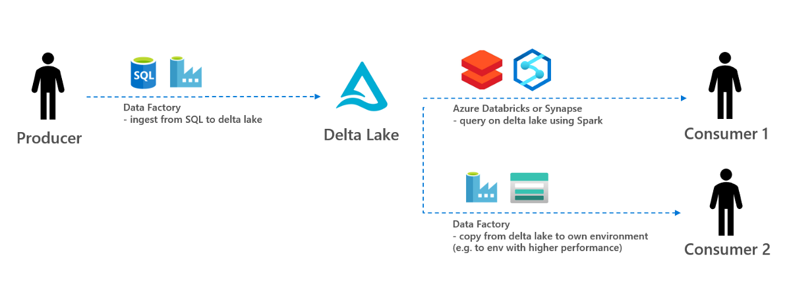

# adf-deltalake-ingestion-consumption



Git repo to ingest data to delta lake using ADF and consume data from delta lake using ADF, Synapse, Databricks. The following architecture is used.

- Data producer: Data from SQLDB is ingested using ADF dataflows to delta lake. Data is ingested using different patterns (all raw data versus aggregated data, full snapshots versus delta increments)
- Data consumer: Once the date ingested to delta lake, consumers can query data using Databricks notebooks and Synapse notebooks. In case consumer want to copy data to own environment, two ADF pipelines are created can copy the snapshot or latest delta to their own environment

Steps to take:

1. Substitute variables and run ```scripts/deploy_resources.sh``` to deploy ADF and deltalake.
2. Run different producer pipelines to ingest data to the delta lake
3. Create a Databricks workspace and run ```notebooks/Databrick_consumer_query_delta.ipynb``` to query data
4. Alternatively, create a Synapse workspace and run ```notebooks/Synapse_consumer_query_delta.ipynb``` to query data
5. Alternatively, run consumer pipelines to consume data to own storage account